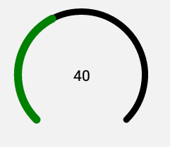

# @Nassim99/React-Native-Gauge

## Description

This is a small simple package to render gauge useing SVG,
Main reason for creating this is that i needed a simple gauge to be implimented in expo project, the ones i found wasn't working on expo and some of them slows the app down.

 

## Installation

```bash
yarn add @nassim99/react-native-gauge
```

or

```bash
npm install @nassim99/react-native-gauge
```

# Usage

## Import

```jsx
import GaugeSVG from "@nassim99/react-native-gauge";
```

## Fundamental Usage

```JSX
const value = 40 // 40% of the gauge. min=0 max=100
    <GaugeSVG
      size={150}
      insideTextColor={'purple'}
      gaugeColor={'black'}
      gaugeValueColor={'blue'}
      gaugeStroke={3}
      gaugeValueStroke={3.5}
      value={value}
    >
        <View style={{
            justifyContent: 'center',
            alignItems: 'center',
            width: '100%',
            height: '100%',
        }}>
          <Text>{value}</Text>
        </View>
    </GaugeSVG>
```

## Peer Dependencies

this library uses react-native-svg package
you should install it in your project

```js
yarn add react-native-svg
```

# Configuration - Props

## Required

| Property |  Type  |  Default  | Description                         |
| -------- | :----: | :-------: | ----------------------------------- |
| value    | number | undefined | number of the value between 0 a 100 |

## Customization (Optionals)

| Property         |  Type  | Default | Description                                                                                                            |
| ---------------- | :----: | :-----: | ---------------------------------------------------------------------------------------------------------------------- |
| gaugeColor       | string |  #ff0   | changes the color of the gauge                                                                                         |
| gaugeValueColor  | string | "#666"  | change the color of the gauge value                                                                                    |
| gaugeStroke      | number |    2    | changes the gauge stroke                                                                                               |
| gaugeValueStroke | number |   2.5   | changes the gauge value stroke                                                                                         |
| insideTextColor  | string |  #999   | changes the color of the text in the center of the gauge, not applicable if gauge have children like the example above |
| size             | number |   150   | changes the width and height of the gauge                                                                              |

## Future Plans

- [x] ~~LICENSE~~
- [ ] Add animation
- [ ] Add tests

# Change Log

## Author

Nassim Redwan, https://github.com/nassim99

## License

@nassim/react-native-gauge is available under the MIT license. See the LICENSE file for more info.
